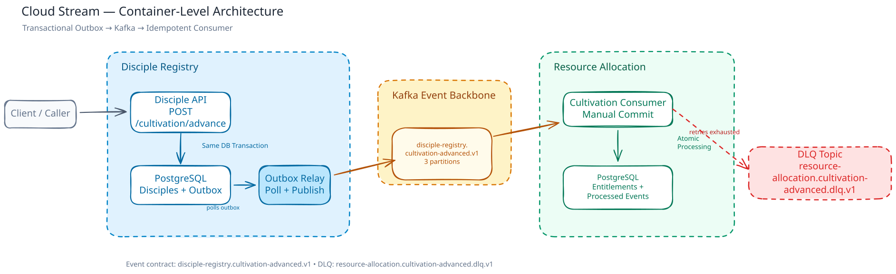

# Cloud Stream

Cloud Stream is a Go-based event-driven system built around PostgreSQL, Kafka, a transactional outbox, idempotent consumers, retry, and dead-letter handling.

## The Story

In **Qinglang World**, one of the Middle Realms, stands the **Azure Cloud Sect**, a powerful cultivation sect.

By ancient custom, whenever a disciple advances, the Disciple Registry sends a message by spirit pigeon to the Resource Allocation Hall. The hall then adjusts the disciple's monthly Spirit Stone stipend, pill credits, talisman credits, and residence entitlement.

Then spatial turmoil strikes the sect. Some spirit pigeons vanish before arrival; others arrive twice.

Some disciples break through yet receive no additional resources, while others receive the same allocation twice.

The sect therefore establishes the **Cloud Stream Formation**. Kafka becomes the event channel between the Disciple Registry and the Resource Allocation Hall.

Cloud Stream is designed to make this delivery reliable: the cultivation advancement and its outgoing event are recorded together, delivery may be retried, and duplicate events must never grant the same resources twice.

## From Lore to Engineering

| Lore | Engineering concept |
| --- | --- |
| Spirit pigeon | Asynchronous integration event |
| Spatial turmoil | Message loss, delay, or duplication |
| Disciple Registry and Resource Allocation Hall | Separate bounded contexts |
| Cloud Stream Formation | Transactional outbox and Kafka |
| Repeated resource allocation | Idempotent consumer processing |
| Failed pigeon delivery | Retry, backoff, and Kafka DLQ |

## What This Demonstrates

- Bounded-context separation across independent Go services
- PostgreSQL transactions and concurrency control
- Transactional Outbox for reliable event publication
- Kafka event delivery with manual offset commits
- Idempotent consumer processing with processed-event tracking
- Retry with backoff and dead-letter handling

## Container-Level Architecture



The architecture separates the producer transaction, outbox relay, Kafka event backbone, and resource-allocation consumer.

## Local Development

### Prerequisites

- Docker Compose
- Go
- PowerShell 7, Bash, or another POSIX-compatible shell

### Bootstrap local infrastructure

The bootstrap script creates missing `.env` files from their examples, starts PostgreSQL and Kafka, waits for both services to become healthy, and creates the required Kafka topics if they do not already exist.

PowerShell:

```powershell
.\scripts\bootstrap.ps1
```

Bash:

```bash
chmod +x scripts/bootstrap.sh
./scripts/bootstrap.sh
```

### Start the services

Run each process from a separate terminal.

Disciple Registry API:

```bash
cd disciple-registry
go run ./cmd/api
```

Disciple Registry Outbox Relay:

```bash
cd disciple-registry
go run ./cmd/worker
```

Resource Allocation Consumer:

```bash
cd resource-allocation
go run ./cmd/worker
```

The API listens on `http://localhost:8081` by default.

Useful endpoints:

```text
GET  /health
GET  /api/v1/disciples
POST /api/v1/disciples/:id/cultivation/advance
```

### Trigger an event

The seed data includes **Lin An** with cultivation `realm=2` and `stage=1`.
Advance Lin An once to produce a cultivation event:

```bash
curl -X POST \
  http://localhost:8081/api/v1/disciples/00000000-0000-4000-8000-000000000002/cultivation/advance \
  -H "Content-Type: application/json" \
  -d '{"currentRealm":2,"currentStage":1}'
```

Then observe the flow in the service logs:

```text
Disciple API → PostgreSQL + Outbox
Outbox Relay → Kafka
Resource Allocation Consumer → PostgreSQL
```

On PowerShell, use `curl.exe` instead of the `curl` alias.

## Tests

Run the test suite for each Go module:

```bash
cd disciple-registry
go test ./...

cd ../resource-allocation
go test ./...
```

## Reliability Guarantees and Known Gaps

### Guarantees

- Disciple state changes and outbox events are written in the same PostgreSQL transaction.
- The relay marks an outbox event as published only after Kafka acknowledges the publish.
- Consumer business writes and processed-event records are committed atomically.
- Duplicate events do not apply the same resource allocation twice.
- Kafka source offsets are committed only after successful processing or successful DLQ publication.
- Exhausted processing retries are published to a Kafka DLQ before the source offset is acknowledged.

### Known Gaps

- No OpenTelemetry instrumentation yet.
- No schema registry or compatibility enforcement.
- No automated DLQ replay tooling.
- Local Kafka and PostgreSQL run as single instances.

## Scope and Non-Goals

Cloud Stream intentionally focuses on reliable event delivery between two bounded contexts. Infrastructure concerns that do not materially contribute to that goal are kept out of scope.

This project does not attempt to provide:

- Highly available Kafka or PostgreSQL clusters
- Authentication and authorization
- Schema governance infrastructure
- A full observability stack
- Multi-region or multi-cluster deployment

## Design Details

For a deeper look at the system design, see [design.md](./design.md), which covers:

- system boundaries and data ownership
- integration event contract and versioning
- producer and consumer transaction boundaries
- transactional outbox lifecycle
- idempotent consumer processing and offset ordering
- reliable event delivery sequence
- retry and DLQ semantics
- failure scenarios, non-goals, and trade-offs