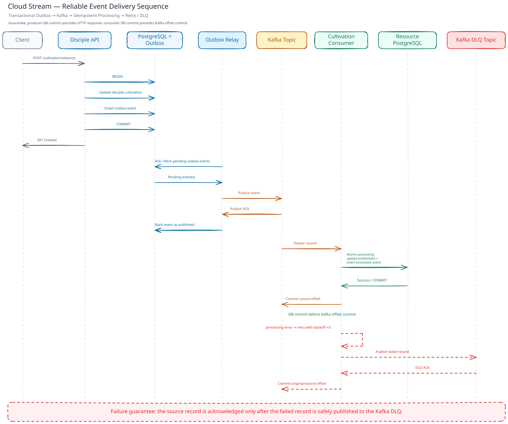

# Cloud Stream Design

Cloud Stream is a small event-driven system focused on reliable event delivery between two bounded contexts. The design favors explicit transaction boundaries and recoverable failure behavior over infrastructure complexity.

## System Boundaries

### Bounded Contexts

Cloud Stream has two bounded contexts:

| Bounded context | Responsibility | Database schema |
| --- | --- | --- |
| Disciple Registry | Owns disciple cultivation state and emits cultivation events | `disciple_registry` |
| Resource Allocation | Consumes cultivation events and owns resource entitlements | `resource_allocation` |

Each context owns its own business state. A `disciple_id` in Resource Allocation is a logical reference derived from an integration event, not a relational foreign key to the Disciple Registry schema.

The local environment uses one PostgreSQL instance for convenience, but schema ownership remains separated. Sharing a database server does not make the contexts one data model.

### Runtime Components

The application has three Go executables:

| Executable | Context | Responsibility |
| --- | --- | --- |
| `disciple-registry/cmd/api` | Disciple Registry | HTTP API and use-case orchestration |
| `disciple-registry/cmd/worker` | Disciple Registry | Polls and publishes outbox events |
| `resource-allocation/cmd/worker` | Resource Allocation | Consumes Kafka events and updates entitlements |

PostgreSQL and Kafka are infrastructure dependencies, not bounded contexts. The Outbox Relay is a worker belonging to Disciple Registry; it is not a third business context.

## Data Ownership and Storage

The complete DDL is kept in [`init.sql`](./init.sql). This document describes ownership and transaction intent rather than duplicating every column definition.

### Table Schemas

The tables below document the important columns, constraints, and ownership decisions. The executable DDL remains [`init.sql`](./init.sql).

#### `disciple_registry.disciples`

The source of truth for disciple identity and cultivation state.

| Column | Type | Constraint | Meaning |
| --- | --- | --- | --- |
| `id` | `uuid` | Primary key | Stable disciple identity |
| `name` | `text` | Not null | Display name |
| `birthday` | `date` | Nullable | Optional birth date |
| `cultivation_realm` | `smallint` | Not null, `1..5` | Current cultivation realm |
| `cultivation_stage` | `smallint` | Not null, `1..3` | Current stage within the realm |
| `spirit_root` | `text` | Not null | Domain attribute |
| `background_type` | `text` | Not null, default `UNKNOWN` | Background classification |
| `background_note` | `text` | Nullable | Additional background information |
| `joined_at` | `date` | Not null | Date the disciple joined the sect |
| `created_at` | `timestamptz` | Not null, default `now()` | Creation timestamp |
| `updated_at` | `timestamptz` | Not null, default `now()` | Last state update timestamp |

#### `disciple_registry.outbox_events`

The durable event intent written with the disciple state change.

| Column | Type | Constraint | Meaning |
| --- | --- | --- | --- |
| `event_id` | `uuid` | Primary key | Integration event identity |
| `disciple_id` | `uuid` | Not null, no cross-context FK | Logical reference to the disciple |
| `event_type` | `text` | Not null | Event contract type |
| `event_version` | `smallint` | Not null, `> 0` | Event contract version |
| `previous_realm` | `smallint` | Not null, `1..5` | Realm before the transition |
| `previous_stage` | `smallint` | Not null, `1..3` | Stage before the transition |
| `current_realm` | `smallint` | Not null, `1..5` | Realm after the transition |
| `current_stage` | `smallint` | Not null, `1..3` | Stage after the transition |
| `occurred_at` | `timestamptz` | Not null | Time of the domain transition |
| `published_at` | `timestamptz` | Nullable | Set after Kafka publish succeeds and the relay marks the row |
| `attempts` | `integer` | Not null, `>= 0` | Failed publish attempt count |
| `last_error` | `text` | Nullable | Most recent publish failure |
| `created_at` | `timestamptz` | Not null, default `now()` | Outbox row creation time |

Pending relay work is selected with `published_at IS NULL`.

#### `resource_allocation.disciple_resource_entitlements`

The Resource Allocation context's local entitlement state. It is updated from events and is not a live join to the Disciple Registry tables.

| Column | Type | Constraint | Meaning |
| --- | --- | --- | --- |
| `disciple_id` | `uuid` | Primary key, no cross-context FK | Logical owner of the entitlement |
| `monthly_spirit_stone_allowance` | `integer` | Not null, `>= 0` | Monthly spirit stone allowance |
| `residence_level` | `smallint` | Not null, `1..5` | Residence entitlement level |
| `talisman_credits` | `integer` | Not null, `>= 0` | Talisman credits |
| `pill_credits` | `integer` | Not null, `>= 0` | Pill credits |
| `updated_at` | `timestamptz` | Not null, default `now()` | Last entitlement update |

#### `resource_allocation.processed_events`

The consumer's idempotency ledger.

| Column | Type | Constraint | Meaning |
| --- | --- | --- | --- |
| `event_id` | `uuid` | Primary key | Event identity claimed by this context |
| `event_type` | `text` | Not null | Event contract type |
| `disciple_id` | `uuid` | Not null, no cross-context FK | Logical disciple reference from the event |
| `processed_at` | `timestamptz` | Not null, default `now()` | Time the event was claimed/processed |

The primary key on `event_id` prevents the same event from applying its business effect more than once.

### Cross-Context References

There are intentionally no foreign keys between the two schemas. This keeps each context independently responsible for its own data and avoids coupling the lifecycle of one context to the storage layout of another.

The trade-off is that referential validation across contexts must happen through event contracts and application behavior rather than database constraints.

## Integration Event Contract

The producer publishes `DISCIPLE_CULTIVATION_ADVANCED` version `1` to:

```text
disciple-registry.cultivation-advanced.v1
```

The event contains:

```json
{
  "eventId": "uuid",
  "discipleId": "uuid",
  "previousRealm": 2,
  "previousStage": 1,
  "currentRealm": 2,
  "currentStage": 2,
  "occurredAt": "timestamp"
}
```

The Resource Allocation consumer publishes exhausted failures to:

```text
resource-allocation.cultivation-advanced.dlq.v1
```

The source topic and DLQ are separate topics with explicit ownership in their names. Versioning belongs to the event contract and topic name so a future contract can be introduced without silently changing the meaning of an existing event.

## Transaction Boundaries and Unit of Work

### Domain Responsibility

The domain owns cultivation rules and state transitions. `Disciple.AdvanceCultivation()` validates the transition and mutates the domain object. The domain does not open database transactions, write outbox rows, or publish to Kafka.

The application service coordinates the use case:

1. Load the disciple.
2. Verify the caller's expected cultivation state.
3. Ask the domain to advance cultivation.
4. Build the integration event from the before/after state.
5. Ask the repository to persist the state and event atomically.

### Producer Transaction

`SaveCultivationAdvance` owns one database transaction in the persistence adapter:

```text
BEGIN
  update disciple_registry.disciples
  insert disciple_registry.outbox_events
COMMIT
```

The HTTP response is returned only after this commit succeeds. Kafka publishing happens later in the Outbox Relay and is not part of the HTTP request transaction.

The domain therefore remains independent from transaction mechanics while the business state and integration event still have atomic persistence.

### Consumer Unit of Work

Resource Allocation uses an explicit Unit of Work because one event requires multiple database operations to succeed together:

```text
BEGIN
  claim resource_allocation.processed_events
  lock the entitlement row
  update resource_allocation.disciple_resource_entitlements
COMMIT
```

If any operation fails, the Unit of Work rolls back. The Kafka source offset is not committed in that case, so the record can be retried.

The Unit of Work is an application/persistence mechanism. It is deliberately not exposed to the domain model.

## Transactional Outbox

The outbox closes the failure window between changing local state and publishing an integration event.

Without an outbox, the API could commit the disciple update and then fail before Kafka publish. With the outbox, the event intent is committed with the state change and remains available for a worker to publish later.

The relay lifecycle is:

1. Fetch pending rows where `published_at IS NULL`.
2. Reconstruct the integration event.
3. Publish synchronously to Kafka and wait for the publish result.
4. Mark successfully published rows with `published_at`.
5. Record failed attempts and retry them on a later poll.

The relay processes batches and polls at a configured interval. A crash after Kafka acknowledges a publish but before `published_at` is written can cause the event to be published again. This is expected at-least-once behavior and is handled by consumer idempotency.

## Consumer Processing and Idempotency

The consumer uses manual offset commits. For each record:

1. Decode the event.
2. Start the Resource Allocation Unit of Work.
3. Claim the event ID in `processed_events`.
4. If the event was already claimed, treat it as a successful duplicate.
5. Lock and update the entitlement.
6. Commit the database transaction.
7. Commit the Kafka source offset.

The important ordering is:

```text
Database COMMIT
      ↓
Kafka source offset COMMIT
```

The consumer does not attempt to make PostgreSQL and Kafka one distributed transaction. Instead, it makes the database operation idempotent and commits the Kafka offset only after the database outcome is durable.

## Reliable Event Delivery Sequence



The sequence diagram shows the producer transaction, outbox publishing lifecycle, consumer database transaction, offset ordering, and failure path.

## Retry and Dead-Letter Queue

Consumer processing failures are retried with a configured backoff and maximum attempt count. If all attempts fail, the consumer publishes the original failed record and processing error metadata to the Kafka DLQ.

The source offset is committed only after the DLQ publish succeeds. If DLQ publication fails, the worker returns an error without acknowledging the source record. This preserves the record for a later retry rather than silently losing it.

The DLQ is a recovery boundary, not a claim that the business operation succeeded. A future replay tool could read DLQ records after an operator has diagnosed and corrected the cause.

## Failure Scenarios

| Failure | Expected behavior |
| --- | --- |
| Database transaction fails in the API | Disciple update and outbox insert are rolled back; no event is committed |
| Kafka publish fails in the relay | Outbox row remains pending and is retried later |
| Relay crashes after Kafka publish but before marking the outbox row as published | Event may be published again; consumer idempotency prevents duplicate business effects |
| Consumer database transaction fails | No source offset commit; Kafka record is retried |
| Duplicate event is delivered | `processed_events` prevents the entitlement update from running twice |
| Processing retries are exhausted | Failed record is published to the Kafka DLQ |
| DLQ publication fails or its result is uncertain | The worker returns an error before committing the source offset; the record remains eligible for redelivery |

## Explicit Non-Goals

This project intentionally does not attempt to provide:

- Exactly-once delivery across PostgreSQL and Kafka
- Distributed transactions or two-phase commit
- Highly available Kafka or PostgreSQL clusters
- Schema registry or compatibility enforcement
- Automated DLQ replay and operator tooling
- OpenTelemetry or a full observability platform
- Multi-region or multi-cluster deployment

These are possible future extensions, but they would add complexity beyond the reliability concerns this project intentionally focuses on.

## Trade-offs

- A single PostgreSQL instance is used locally to keep setup small, while schemas preserve ownership boundaries.
- At-least-once delivery is accepted in exchange for simpler recovery and explicit idempotency.
- The outbox relay uses polling instead of a database changefeed to keep the mechanism visible and easy to run locally.
- The DLQ stores failed records for recovery, but replay remains a deliberate future tool rather than an implicit automatic action.
